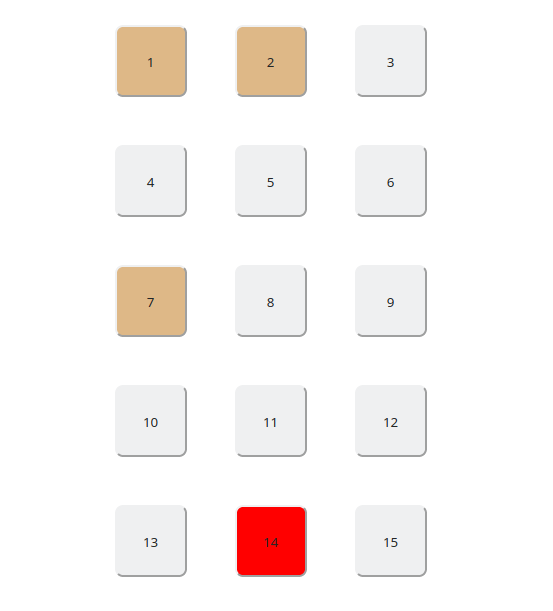

# Multiplication

Educational tool to teach children about multiplication.

Displays a grid of 144 numbered 1..144.
Clicking on a box causes highlights of boxes with numbers that are multipliers of the selected box.

The clicked button will become red, while multipliers brownish.

It display 1 column on mobile devices, 2 columns on tablets and 3 columns on desktops.



## installation

```bash
npm install
```

## running

Application will start in `dev` mode with `hot-reloading` and will become accessible at `localhost:8081`

```bash
npm start
```

## building

Application will get bundled into `build` folder.

```bash
npm run build
```

## testing

Tests are run using `Jest` and `Enzyme` framework.

```bash
npm test
```

With file change watcher:

```bash
npm run test:watch
```

With coverage print out:

```bash
npm run test:coverage
```

